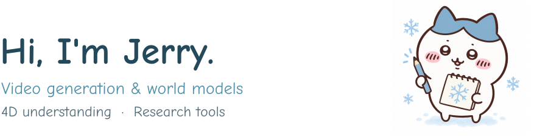
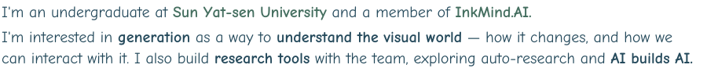

<picture>
  <source media="(prefers-color-scheme: dark) and (max-width: 600px)" srcset="assets/hero-mobile-dark.svg">
  <source media="(max-width: 600px)" srcset="assets/hero-mobile-light.svg">
  <source media="(prefers-color-scheme: dark)" srcset="assets/hero-desktop-dark.svg">
  
</picture>

<picture>
  <source media="(prefers-color-scheme: dark) and (max-width: 600px)" srcset="assets/bio-mobile-dark.svg">
  <source media="(max-width: 600px)" srcset="assets/bio-mobile-light.svg">
  <source media="(prefers-color-scheme: dark)" srcset="assets/bio-desktop-dark.svg">
  
</picture>

<a href="https://jerrysnow.me/"><picture><source media="(prefers-color-scheme: dark)" srcset="assets/nav-home-dark.svg"></picture></a>
<a href="https://scholar.google.com/citations?user=8PtwUrkAAAAJ&amp;hl=en"><picture><source media="(prefers-color-scheme: dark)" srcset="assets/nav-scholar-dark.svg"></picture></a>
<a href="mailto:xuyx85@mail2.sysu.edu.cn"><picture><source media="(prefers-color-scheme: dark)" srcset="assets/nav-mail-dark.svg"></picture></a>

<picture>
  <source media="(prefers-color-scheme: dark) and (max-width: 600px)" srcset="assets/connect-mobile-dark.svg">
  <source media="(max-width: 600px)" srcset="assets/connect-mobile-light.svg">
  <source media="(prefers-color-scheme: dark)" srcset="assets/connect-desktop-dark.svg">
  
</picture>

<picture><source media="(prefers-color-scheme: dark)" srcset="assets/closing-dark.svg"></picture>
